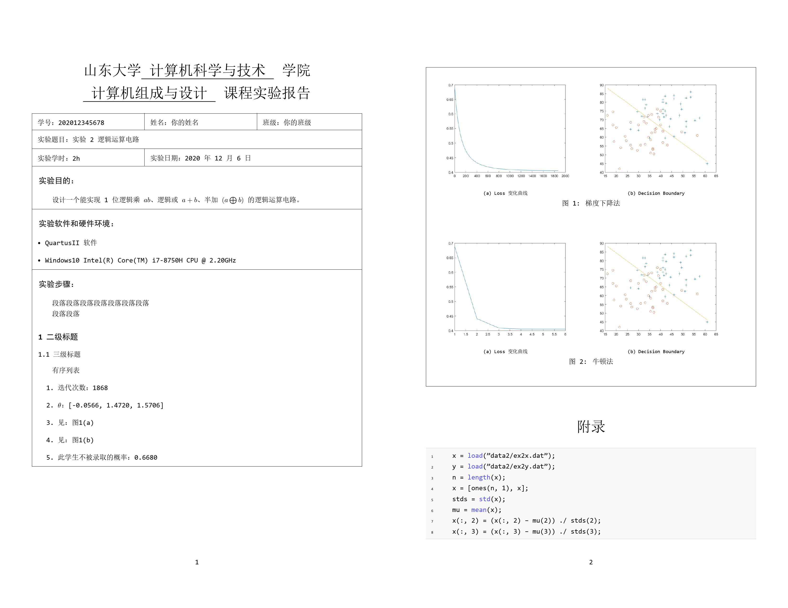

# sdu_report_song

LaTeX 模板用于山东大学实验报告(*~~song的意思为宋体~~*)

# 更新

## 2021.3.24更新
+ 完善demo演示内容
+ 二级标题改为中文数字
+ 解决了如果一页中含有`section`会出现两行横线的问题。

## 2020.12.06更新

+ 加入`anyfontsize`包，解决公式字体报错问题

## 2020.11.22更新

+ 修改代码区代码，解决部分字符串中的乱码

## 2020.10.28更新
+ 引入`amsmath`包，现在可以正常使用`\begin{aligned}\end{aligned}`了

## 2020.10.26更新
+ 二级标题加粗
+ 三级标题改为五号字体

## 2020.09.28更新

+ 修改了附录加入逻辑，现在可以自己决定是否需要附录，不需要去配置文件中更改

## 2020.09.23更新

+ 引用了`booktabs`包
+ 修复了表注与表格距离过近的问题

## 2020.04.22更新

+ 引入`ctex`包，中文字体更改为宋体，恢复段首缩进
+ 修复了sduDocument前可能会出现两条分页符的bug
+ 调整了学号、实验题目、实验学时三行的行间距
+ 图注由Figure 1更改为图1
+ 删除附录
+ image文件夹更名为figures

# 参考

1. [latexstudio/CUMCMThesis](https://github.com/latexstudio/CUMCMThesis)
2. [liweitianux/resume](https://github.com/liweitianux/resume)
3. [Creating table like frame](https://tex.stackexchange.com/questions/440009/creating-table-like-frame)

