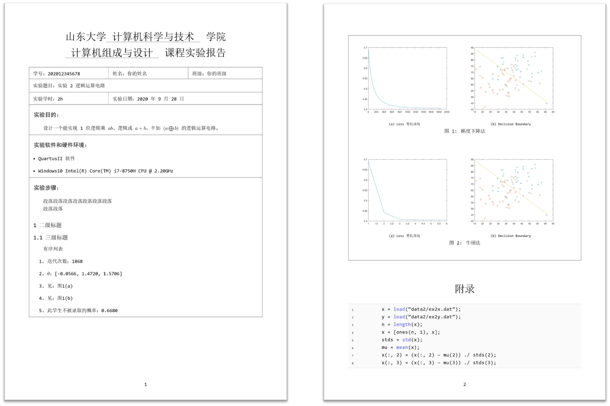

# sdu_report_song

LaTeX 模板用于山东大学实验报告(*~~song的意思为宋体~~*)

## 2020.9.28更新
+ 修改了附录加入逻辑，现在可以自己决定是否需要附录，不需要去配置文件中更改

## 2020.9.23更新
+ 引用了booktabs包
+ 修复了表注与表格距离过近的问题

## 更新

+ 引入ctex包，中文字体更改为宋体，恢复段首缩进
+ 修复了sduDocument前可能会出现两条分页符的bug
+ 调整了学号、实验题目、实验学时三行的行间距
+ 图注由Figure 1更改为图1
+ 删除附录
+ image文件夹更名为figures

## 参考

1. [latexstudio/CUMCMThesis](https://github.com/latexstudio/CUMCMThesis)
2. [liweitianux/resume](https://github.com/liweitianux/resume)
3. [Creating table like frame](https://tex.stackexchange.com/questions/440009/creating-table-like-frame)

